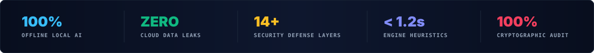

<a id="top"></a>
<div align="center">

<!-- HERO ANIMATED SVG BANNER -->


<br/>

<!-- DYNAMIC TYPING SVG ANIMATION -->
<a href="#-system-architecture">
  
</a>

<p align="center">
  <b>A zero-compromise, air-gapped forensic intelligence platform detecting job scams, recruitment fraud, check advance schemes, and credential harvesting in real-time.</b>
</p>

<!-- BADGE MATRIX -->
<p align="center">
  
  
  
  
  
  
  
  
</p>

<!-- KEY METRICS ANIMATED STRIP -->


<br/>

<!-- QUICK ANCHOR NAVIGATION -->
<p align="center">
  <a href="#-live-threat-scanner--radar"><b>🎯 Threat Radar</b></a> •
  <a href="#-pipeline-architecture"><b>⚡ Pipeline Flow</b></a> •
  <a href="#-enterprise-security-matrix"><b>🛡️ Security Matrix</b></a> •
  <a href="#-quickstart--local-execution"><b>🚀 Quickstart</b></a> •
  <a href="#-docker-production-deployment"><b>🐳 Docker</b></a> •
  <a href="#-developer-api-v1"><b>📡 Developer API</b></a> •
  <a href="#-automated-testing-suites"><b>🧪 Testing</b></a>
</p>

</div>

---

## 🎯 Live Threat Scanner & Radar

ScamGuard AI runs multi-vector heuristic and LLM analysis against suspicious recruitment correspondence, offer letters, employment contracts, and recruiter domains.

<!-- LIVE SCANNER ANIMATION CARD -->
<p align="center">
  
</p>

### 🚨 Core Fraud Patterns Detected
* **Advance Fee & Equipment Fraud**: Demands for candidate payment, home-office wire transfers, or fake equipment checks.
* **Recruiter Impersonation**: Typosquatting and newly registered lookalike domains (e.g. `@google-careers-portal.cc` mimicking genuine corporate portals).
* **Identity Harvesting**: Premature requests for SSN, banking details, passport scans, or crypto wallet transfers before interviews.
* **Suspicious Communication Channels**: Directing applicants to unverified Telegram, WhatsApp, or Signal handles for interviews.
* **Counterfactual What-If Modeling**: Live sandbox to simulate how changes in offer clauses impact overall forensic threat scores.

---

## ⚡ Pipeline Architecture

The platform processes every document through a strict, multi-layered isolation pipeline. **Data never leaves your local infrastructure.**

<!-- ANIMATED PIPELINE FLOW DIAGRAM -->
<p align="center">
  
</p>

```
                          [ Client Browser ]
                                   │
               ┌───────────────────┴───────────────────┐
               │ HTTPS / Strict CSP / Security Headers  │
               ▼                                       ▼
    [ Flask API Backend (5000) ]             [ Frontend SPA ]
       - Auth & Token Revocation                - HTML5 / CSS3 / Vanilla JS
       - Multi-Stage Analysis Pipeline          - Forensic Investigation Console
       - SSRF & Safe Network Filters            - Real-time Stage Progression
       - File Upload Security Validation        - Security Center & Sessions
       - Rate Limiting & Audit Logging          - Standalone Forensic A4 PDF
               │                     │
               ▼                     ▼
      [ Local Ollama AI ]     [ MongoDB (27017) ]
       - llama3.2:3b           - Users & Sessions
       - 100% Offline          - Analyses & History
       - Zero Cloud Fallback   - Audit Logs & Indexes
               │
               ▼
    [ Node.js Mail Service (5001) ]
       - Express + Nodemailer
       - Generic SMTP / Dev Simulator
       - Protected by Internal Secret
```

---

## 🛡️ Enterprise Security Matrix

| # | Defense Layer | Implementation Detail | Guarantee |
| :-: | :--- | :--- | :--- |
| **01** | **100% Local AI Core** | Local Ollama engine (`llama3.2:3b`) with zero cloud API reliance. | **Zero Cloud Leaks**: If Ollama is offline, returns a 503 instead of risking external leaks. |
| **02** | **Deep Magic-Byte Validation** | Byte inspection for `%PDF-`, PNG, JPEG, WEBP, DOCX signatures. Executables rejected. | Prevents polyglot payloads, masquerading binaries (`MZ`/`ELF`), and script execution. |
| **03** | **SSRF Quarantine** | Pre-flight DNS validation blocking private/loopback/cloud metadata (`169.254.169.254`). | Eliminates Server-Side Request Forgery and DNS rebinding attacks. |
| **04** | **Two-Factor Auth (TOTP 2FA)** | RFC 6238 compliant TOTP with QR provisioning + single-use hashed recovery keys. | Protects administrative and investigator accounts against credential stuffing. |
| **05** | **Active Session Revocation** | Device fingerprinting (IP, User-Agent) + cryptographic `token_version` tracking. | Instant remote sign-out across all devices upon password reset or admin revoke. |
| **06** | **HMAC-SHA256 Webhooks** | Outbound HTTP webhooks signed with timestamped HMAC-SHA256 headers. | Prevents replay attacks and verifies payload authenticity for automated SIEM pipelines. |
| **07** | **Scoped Developer API Keys** | API keys with hash-only storage in MongoDB and key prefix retrieval. | Safe programmatic pipeline automation with granular access revocation. |
| **08** | **Side-by-Side Comparison** | Delta engine calculating indicator shifts, risk differentials, and flag deltas. | Precise regression testing of revised or re-issued employment contracts. |
| **09** | **Counterfactual Simulation** | Non-destructive "What-If" sandbox testing hypotheticals without modifying raw cases. | Interactive threat exploration and investigator hypothesis validation. |
| **10** | **Dynamic Checklist Engine** | Real-time verification checklist mapped to detected forensic indicators. | Actionable, auditable candidate remediation steps persisted in MongoDB. |
| **11** | **Node.js Mail Microservice** | Independent microservice on port `5001` secured with an internal bearer secret. | Isolates email dispatch (7 HTML templates) with automatic local dev simulation. |
| **12** | **Automated File Retention** | Background pruning cycle deleting temporary uploads older than `FILE_RETENTION_HOURS`. | Zero residual document retention complying with data privacy regulations. |
| **13** | **Sliding Rate Limiter** | In-memory token bucket rate limiting on sensitive routes (`/login`, `/analyze`). | Thwarts brute force, credential cracking, and denial-of-service attempts. |
| **14** | **Public Verification Registry** | High-entropy share tokens (`/shared/report/<token>`) & public validation (`/verify/report/<id>`). | Authentic document verification without exposing underlying applicant PII. |

---

## 🚀 Quickstart & Local Execution

### Prerequisites
* **Python 3.10+**
* **Node.js 18+** & `npm`
* **MongoDB 6.0+** (running on `localhost:27017`)
* **Ollama** with `llama3.2:3b` model installed

```bash
# 1. Pull the authoritative forensic model
ollama pull llama3.2:3b
```

### 1. Clone & Configure Environment

```bash
git clone https://github.com/ASTA91-GIT/scam-detector.git
cd scam-detector

# Copy environment template
cp .env.example .env
```

### 2. Install Dependencies

```bash
# Install Python backend dependencies
pip install -r requirements.txt

# Install Node.js mail microservice dependencies
cd services/mail && npm install && cd ../..
```

### 3. Launch Services (3 Terminals)

```bash
# Terminal 1: Start Ollama LLM Engine
ollama serve

# Terminal 2: Start Internal Mail Microservice
node services/mail/server.js

# Terminal 3: Start ScamGuard Flask Application
python app.py
```

> 🌐 **Access Platform**: Open [`http://localhost:5000`](http://localhost:5000) in your browser.

---

## 🐳 Docker Production Deployment

Deploy the complete multi-service production stack (Flask API + Node.js Mail Microservice + MongoDB) with a single command:

```bash
docker compose up -d --build
```

### Stack Endpoints
* **Web UI & API**: [`http://localhost:5000`](http://localhost:5000)
* **MongoDB Instance**: `localhost:27017`
* **Internal Mail Service**: `http://localhost:5001` (Protected by internal secret)

To stop and remove containers:
```bash
docker compose down
```

---

## 🔍 Preflight Verification

Execute the automated system verification utility before deploying to production:

```bash
python scripts/preflight_check.py
```

<details>
<summary><b>View Sample Preflight Output</b></summary>

```
=================================================================
  SCAMGUARD AI — PRODUCTION PREFLIGHT CHECK
=================================================================
  [✓] Configuration & Environment Variables
  [✓] MongoDB Connection & Required Indexes
  [✓] Ollama Engine & Model (llama3.2:3b)
  [✓] OCR & Document Pipeline (pypdfium2: OK, PyPDF2: OK, Pillow: OK)
  [✓] Node.js Mail Service (Simulator / SMTP)
  [✓] Domain Intelligence & SSRF Protection Filters
  [✓] Upload Directory Storage Permissions
  [✓] Security Configuration (Debug disabled)
=================================================================
  RESULT: READY FOR DEPLOYMENT
=================================================================
```
</details>

---

## 📡 Developer API v1

ScamGuard includes a RESTful Developer API secured via `X-API-Key` headers.

### Core Endpoints

| Method | Endpoint | Description | Auth Required |
| :--- | :--- | :--- | :--- |
| `POST` | `/api/v1/analyze` | Submit offer text or file for forensic analysis | `X-API-Key` |
| `GET` | `/api/v1/analysis/<id>` | Retrieve full analysis dossier and risk score | `X-API-Key` |
| `GET` | `/api/v1/domain/<domain>` | Inspect domain WHOIS, age, and lookalike risks | `X-API-Key` |
| `POST` | `/api/v1/keys` | Generate a new developer API key | JWT Session |
| `GET` | `/api/v1/keys` | List active developer API keys | JWT Session |
| `DELETE` | `/api/v1/keys/<id>` | Revoke an API key immediately | JWT Session |
| `POST` | `/api/v1/webhooks` | Register a signed webhook destination | JWT Session |
| `POST` | `/api/v1/webhooks/<id>/test` | Send a test ping with HMAC-SHA256 signature | JWT Session |

### Programmatic Analysis Example

```bash
curl -X POST http://localhost:5000/api/v1/analyze \
  -H "X-API-Key: sg_live_YOUR_API_KEY_HERE" \
  -H "Content-Type: application/json" \
  -d '{
    "text": "Congratulations! You have been selected for the Remote Assistant role. Please deposit this $2,000 cashier check to purchase home office hardware from our approved vendor.",
    "company": "Global Tech Logistics",
    "recruiter_email": "hr@globaltech-logistics-careers.biz"
  }'
```

<details>
<summary><b>View JSON Response</b></summary>

```json
{
  "status": "success",
  "data": {
    "analysis_id": "67a3f81e9b1d2e3f4a5b6c7d",
    "risk_score": 96,
    "risk_level": "critical",
    "primary_threat": "advance_fee_fraud",
    "confidence": 0.98,
    "flags": [
      "Overpayment / Fake Cashier Check Scam pattern identified",
      "Suspicious unverified recruiter domain registered < 14 days ago",
      "Upfront equipment payment requested prior to onboarding"
    ],
    "recommendations": [
      "Do NOT deposit checks from unknown parties",
      "Cease all communication with the sender",
      "Report domain to anti-phishing registrars"
    ],
    "verification_token": "sg_ver_9f83ac127e8a4d"
  }
}
```
</details>

### HMAC-SHA256 Webhook Verification

Every webhook dispatch includes an `X-ScamGuard-Signature` header. Verify payloads using:

```python
import hmac, hashlib

def verify_scamguard_webhook(payload_bytes: bytes, secret: str, received_signature: str) -> bool:
    computed = hmac.new(
        key=secret.encode('utf-8'),
        msg=payload_bytes,
        digestmod=hashlib.sha256
    ).hexdigest()
    return hmac.compare_digest(computed, received_signature)
```

---

## 🧪 Automated Testing Suites

Execute comprehensive testing across all backend, security, and microservice components:

```bash
# 1. Run Production Upgrade Suite (2FA, API Keys, Webhooks, Simulation, Checklist)
pytest tests/test_production_upgrade_suite.py -v

# 2. Run Production Readiness Suite (SSRF, Magic-Byte Uploads, Lookalikes, Rate Limiting)
pytest tests/test_production_readiness_suite.py -v

# 3. Run Certificate & Document Quality Suite
pytest tests/test_certificate_scam_suite.py -v

# 4. Run Mail Microservice Integration Tests
node services/mail/test.js
```

---

## 📋 Environment Configuration Reference

| Environment Variable | Description | Default / Recommended |
| :--- | :--- | :--- |
| `FLASK_ENV` | Application runtime environment (`development` / `production`) | `production` |
| `SECRET_KEY` | Cryptographic secret for Flask sessions | Secure random string (min 32 chars) |
| `JWT_SECRET_KEY` | Signing key for authentication tokens | Secure random string (min 32 chars) |
| `MONGODB_URI` | Connection URI for the MongoDB instance | `mongodb://127.0.0.1:27017/job_scam_detector` |
| `OLLAMA_BASE_URL` | Local endpoint for the Ollama inference engine | `http://127.0.0.1:11434` |
| `OLLAMA_MODEL` | Authoritative local LLM model tag | `llama3.2:3b` |
| `MAIL_SERVICE_URL` | Internal Node.js mailer microservice address | `http://localhost:5001` |
| `MAIL_SERVICE_SECRET` | Internal shared secret protecting mail endpoints | High-entropy random secret |
| `SMTP_HOST` | Outbound production SMTP server hostname | `smtp.example.com` |
| `SMTP_PORT` | Outbound production SMTP port | `587` |
| `SMTP_USER` | SMTP authentication user | `apikey` |
| `SMTP_PASSWORD` | SMTP authentication password | Secret |
| `SMTP_FROM` | Sender address for outgoing forensic notifications | `no-reply@scamguard.local` |
| `MAX_UPLOAD_SIZE` | Maximum permitted file upload size in bytes | `10485760` (10 MB) |
| `MAX_DOCUMENT_PAGES` | Upper bound for PDF analysis to prevent DoS | `20` |
| `FILE_RETENTION_HOURS` | Retention threshold for uploaded temp files | `24` |
| `RATE_LIMIT_ENABLED` | Global toggle for route rate limiting | `true` |
| `HIGH_RISK_EMAIL_THRESHOLD` | Risk score threshold triggering email alerts | `75` |

---

## 📂 Project Structure

```
SCAM-DETECTOR-GDG/
├── assets/
│   └── readme/                          # Animated vector assets & diagrams
│       ├── banner.svg                   # Dynamic cyberpunk hero banner
│       ├── metrics-bar.svg              # Live metrics & compliance strip
│       ├── pipeline-flow.svg            # Animated 5-stage data flow diagram
│       └── scanner-card.svg             # Live radar & threat terminal preview
├── backend/
│   ├── api_keys.py                      # Developer API key hashing & validation
│   ├── audit.py                         # Append-only immutable security audit log
│   ├── auth.py                          # Session management & token revocation
│   ├── domain_intel.py                  # Lookalike & typosquatting detection
│   ├── mail_client.py                   # Client for internal mail microservice
│   ├── rate_limit.py                    # Sliding-window in-memory limiter
│   ├── security_upload.py               # Magic-byte deep signature verification
│   ├── ssrf.py                          # Safe network & private IP quarantine
│   ├── totp_service.py                  # RFC 6238 2FA & recovery codes
│   └── webhooks.py                      # Cryptographic HMAC-SHA256 dispatch
├── frontend/                            # Forensic Investigation Web Console
│   ├── analyze.html / .js               # Multi-format document analysis
│   ├── dashboard.html / .js             # Incident dashboard & telemetry
│   ├── result.html / .js                # Deep forensic dossier & simulator
│   ├── settings.html / .js              # 2FA setup, sessions, API keys & webhooks
│   └── styles.css                       # Modern dark-mode cyber design system
├── services/
│   └── mail/                            # Dedicated Node.js mail microservice
│       ├── server.js                    # Express microservice (port 5001)
│       └── templates/                   # 7 responsive HTML email templates
├── scripts/
│   ├── preflight_check.py               # Production readiness verification
│   └── cleanup_uploads.py               # Automated temp file retention worker
├── tests/                               # Comprehensive pytest suites
├── docker-compose.yml                   # Complete multi-service orchestration
├── Dockerfile                           # Hardened Flask backend container
├── requirements.txt                     # Pinned Python dependencies
└── app.py                               # Application entrypoint & route registry
```

---

<div align="center">

### 🛡️ ScamGuard AI — Built for Privacy, Precision & Performance

<p align="center">
  <sub>Developed for the GDG Hackathon • Licensed under the MIT License • 100% Offline AI Security</sub>
</p>

[⬆ Back to Top](#top)

</div>
